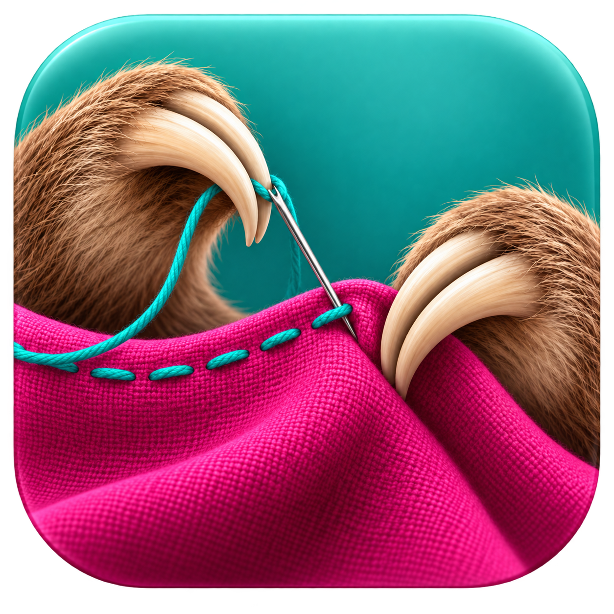

# Seamstress

**Many generations. One continuous shot.**

Seamstress is a local studio for **AI-generated oners**: continuous single shots built by generating a clip, extending the same shot through subsequent AI video generations, and stitching them together.

Each continuation can introduce a slight inconsistency—a changed crop, a small scale or composition shift, or colors that no longer match. Those seams interrupt the feeling of one unbroken take. Seamstress helps you find and smooth them in the already-stitched video while preserving its original frames and timing.

**[Download for Apple silicon](https://github.com/heresalexandria/seamstress/releases/latest/download/Seamstress-mac-arm64.dmg)** · **[Download for Intel Mac](https://github.com/heresalexandria/seamstress/releases/latest/download/Seamstress-mac-x64.dmg)** · [Release notes](https://github.com/heresalexandria/seamstress/releases/latest)

Release installers are built by GitHub Actions, signed with Developer ID, notarized by Apple, and verified before publication. Open the DMG and drag **Seamstress** into Applications. The app includes its processing engine and FFmpeg; no Python installation or API key is needed.

## Refine your oner

1. **Bring the stitched shot.** Drop in the single video file containing your sequential generations. You do not need the separate source clips. Seamstress scans the whole timeline for candidate seams; common 10-, 15-, and 30-second generation lengths help detection without restricting marker positions.
2. **Review the joins.** Check where one generation continues into the next. Add, remove, or drag markers, or enter a precise timecode.
3. **Match continuity.** Analyze framing and color differences, apply supported corrections, and compare the original and corrected seam previews. Watch the full shot to judge how each correction feels in motion.
4. **Export your oner.** Save at the original resolution and frame rate, with original audio preserved.

Seamstress is designed for small continuity mismatches between generations of the same shot. It applies gradual, bounded framing and color corrections to original frames. The desktop workflow never morphs drawings, crossfades poses, or generates replacement frames. It skips corrections that lack reliable evidence. A changed character, gesture, or scene may still be visible; inspect previews before exporting.

The installed app checks GitHub Releases for updates. Click the version button or **Seamstress → Check for Updates…** to download an update and restart when ready. Processing must finish or be cancelled before installation. See [how updates work](docs/updates.md).

## Command line

Install Python 3.12 or newer and FFmpeg, then:

```sh
python3 -m venv .venv
source .venv/bin/activate
python -m pip install -r requirements.lock
python -m pip install --no-deps -e .
seamstress process oner.mp4 --work-dir oner.seamstress --output oner-corrected.mp4
```

One command runs detection, analysis, correction previews, and export. The same stages can run separately with `detect`, `mark`, `calibrate`, `preview`, and `export`. Projects save markers, analysis, correction plans, and revision-specific artifacts for repeatable review.

**[Desktop and CLI guide](docs/SEAMSTRESS.md)** includes individual commands, seam timecodes, supported inputs, and limitations. The current engine supports constant-frame-rate, square-pixel, 8-bit SDR video; it is not an HDR mastering workflow.

## Develop and release

```sh
# After the Python setup above:
cd app
npm ci
npm run dev
```

The source artwork is `icon.png`. After replacing it, run `.venv/bin/python scripts/create_icon.py` from the repository root to refresh the desktop PNG and macOS icon.

```sh
.venv/bin/python -m unittest discover -s tests -v
npm --prefix app test
npm --prefix app run build
npm --prefix app run test:e2e
```

[Release guide](docs/RELEASES.md) · [Signing and notarization](docs/MACOS-SIGNING.md) · [Updater design](docs/updates.md)

CI tests pull requests and builds native packages. A merged PR with exactly one `major`, `minor`, or `patch` label starts the signed release pipeline; `no-release` skips publication. Both Mac architectures must pass signing, notarization, package verification, and the actual app workflow before installers and update metadata are published together.

## Earlier implementations and reproduction

The previous GitHub implementation is preserved unchanged in [legacy/](legacy/README.md), with its original history retained. It is separate from the current desktop app and CLI.

The accepted original-frame experiment remains reproducible: [IYTYT eight-join guide](docs/REPRODUCE-IYTYT.md), [color refinement](docs/REPRODUCE-COLOR-REFINEMENT.md), and [research history](docs/EXPERIMENTS.md). Source videos and generated outputs are local files and are not included in this repository.

The [reviewed framing candidate](docs/REPRODUCE-FRAMING-REVIEW.md) restores the 1:00 and 1:15 framing and reduces the 1:30 camera overcorrection. Its recipe explicitly records the reviewed 1:15 decision; the 2:00 depth jump remains unresolved. [Framing analysis](docs/FRAMING-REVIEW.md) explains the automatic checks and limits.
